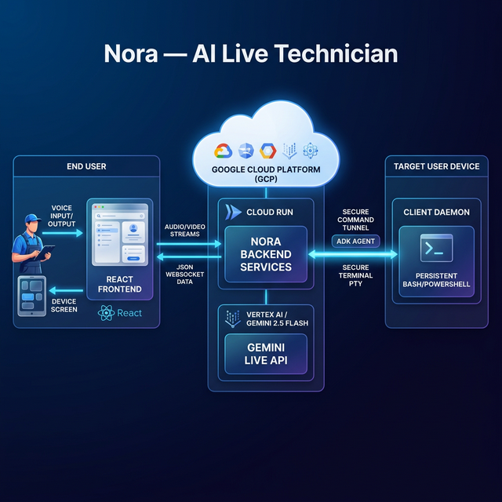

# Nora — Personal AI Assistant

> 🏆 **Google Live Agent Hackathon**
> **Category:** Live Agents 🗣️
> An advanced multimodal AI assistant that can **See, Hear, Speak, and Act** to help users accomplish complex tasks in real-time, from writing code and compiling apps to troubleshooting their PC.

## 🚀 Overview

Nora is not just a chatbot; she's an open-source autonomous AI agent living on your local machine. Built using the **Google ADK (Agent Development Kit)** and the **Gemini Live API**, Nora allows users to:
- Talk naturally about their tasks or problems via real-time bidirectional audio.
- Share their screen or upload reference documents.
- Grant the AI access to run safe, whitelisted **personal assistant tools** and CLI commands directly on their machine.

The agent automatically detects whether the user is running **macOS** or **Windows** and seamlessly loads a tailored suite of tools (write_file, create_project, build_and_run, open_url, plus diagnostic tools) to autonomously complete tasks without asking manual questions.

---

## ✨ Key Features

| Capability | How It Works |
|:---:|---|
| 👂 **Hear** | Real-time voice streaming at 16kHz PCM. The user can speak naturally, and the agent listens continuously. |
| 🗣️ **Speak** | The agent responds with natural, sub-second latency voice (24kHz PCM) powered by Gemini 2.5 Flash Native Audio. |
| 👁️ **See** | Users can share their screen, drag-and-drop images, or upload screenshots. The agent reads error codes, BSOD screens, and UI elements to provide visual context. |
| 🛠️ **Act (Live Command Engine)** | Nora uses a **persistent, stateful command shell** and high-level tools living on the user's host machine. She can write documents, scaffold entire coding projects (`create_project`, `compile_and_run`), open applications, manage clipboard data, and troubleshoot system issues interactively. |
| 🛑 **Graceful Interruption** | A core hackathon requirement: users can interrupt the agent mid-sentence simply by speaking over it or clicking the mic. The system instantly clears audio buffers and coordinates backend cancellation events to handle the interruption smoothly. |

---

---

## 🏗️ Architecture & System Design

Nora's architecture is a state-of-the-art **bidi-streaming, hybrid cloud-local topology**. It is engineered to achieve sub-second latency for natural voice interactions while safely delegating root execution to the user's local operating system.



### 1. Fast, Bidirectional Streaming Pipeline (Google ADK)
Inspired by the **Google Agent Development Kit (ADK)** reference architecture, we discarded traditional request/response paradigms in favor of pure WebSocket streams. 

When a user speaks, the React frontend streams **raw 16kHz PCM audio** directly to the FastAPI Backend WebSocket handler. Inside the backend, a concurrent connection manager handles the intricate lifecycle:
- **Upstream Task (`handle_client_messages`)**: Receives the continuous audio and screenshot inputs from the `Web Socket` and pushes them directly into a low-latency **`live_request_queue`**.
- **Agent Development Kit Logic**: The ADK seamlessly consumes from the `live_request_queue` and bridges the connection over to the **Gemini Live Streaming API**, preserving session state and multi-turn context (`SessionState`).
- **Downstream Task (`handle_agent_responses`)**: As Gemini streams native 24kHz audio and tool execution requests back down, they are yielded as discrete **`Events`**. The downstream task intercepts these events, forwarding audio back to the React UI for instant playback.

This architecture fundamentally reduces "time to first byte" (TTFB) and allows for true **graceful interruptions**—if the user speaks while Nora is talking, the input buffer generates an interrupt signal, immediately clearing the output audio queue and coordinating the cancellation down the entire event chain.

### 2. Persistent Autonomous Execution (The "Live Command Engine")
While the intelligence resides in Google Cloud, the *action* happens locally. The backend communicates synchronously with our **Client Daemon** using a dedicated remote tool execution WebSocket (the "Tool Interceptor WS").

- **Stateful Terminals (PTY Server):** The client daemon spawns a real, persistent `powershell.exe` or `/bin/bash` session. Directory changes (`cd`) and variables carry over between commands just like an SSH session.
- **Interactive Prompts:** If a process asks *"Are you sure? [y/N]"*, the backend does not hang. Nora reads the standard output stream, generates the answer `"y"`, and pushes it into the interactive terminal dynamically.
- **Unrestricted Problem Solving:** Because the ADK tool layer dynamically wraps these CLI capabilities, Nora can synthesize raw shell commands to fix bespoke issues the developers never explicitly anticipated.
- **Desktop Organization:** Nora can now "See" a messy desktop and autonomously arrange it into categorized folders (Screenshots, Images, Documents) using her dynamically hooked filesystem tools.
- **Safety First:** The local daemon validates all incoming commands against a rigorous blocklist, preventing destructive operations or privacy-violating read access.

### 3. Cinematic UX & Real-Time Feedback
- We've broken the "textbox paradigm." When the user asks Nora to write a python app or fix their Bluetooth:
- They don't just get a text reply saying "Here is the code."
- A **Live Activity** dashboard slides in via React, showing a cinematic stream of the exact execution results streaming back from the Client Daemon (`> Project 'calculator' created`, or `> python3 main.py`).
- **OS-Aware Onboarding:** The frontend detects the user's OS and provides tailored, one-click download links for the **Nora Daemon (.zip)** directly from the cloud backend.

---

## 🛠️ The Nora Client Daemon (The Live Engine)

While Nora's "brain" resides in Google's cloud, the **Nora Client Daemon** acts as her local "hands." It is a lightweight, asynchronous Python agent that runs on the user's host machine, bridging the gap between high-level reasoning and low-level system execution.

### ⚙️ How It Works: The "Uplink" Architecture
The daemon operates via a persistent **Secure WebSocket (WSS)** connection back to the Nora Orchestrator:
1.  **Pairing & Handshake:** When started, the daemon requires a **Session ID** (generated uniquely by the React frontend). This ensures a secure 1:1 pairing between the browser interface and the host machine.
2.  **Host Discovery:** The daemon automatically identifies the Host OS (macOS or Windows) and dynamically hooks the appropriate **Agent Tools** (e.g., `mac_tools` using `osascript`/`ifconfig` or `windows_tools` using `PowerShell`).
3.  **Autonomous Tool Execution:** When the Gemini model decides to act (e.g., `"I will create a directory and write the code"`), the Orchestrator sends a `tool_call` event to the daemon. The daemon executes the command locally and streams the `stdout/stderr` back in real-time.
4.  **Stateful Terminal Management:** Unlike simple script runners, the daemon manages persistent shell sessions. Directory changes (`cd`) and environment variables persist across multiple turns.
5.  **Safety & Security:**
    *   **Command Whitelisting:** All core tools (network, system, disk) use pre-defined, hardened commands.
    *   **Injection Protection:** Arguments are sanitized using `shlex` quoting to prevent shell injection.
    *   **Blocklist Enforcement:** Destructive commands (e.g., `rm -rf /`, formatting disks) and privacy-violating operations (e.g., accessing keychains) are strictly blocked by a hardcoded security filter.

---

## 🚀 Judging & Testing Guide

To experience Nora's full autonomous capabilities, judges should run both the cloud-connected frontend and the local host daemon.

### 1. Prerequisite: Start the System
Follow the [Spin-Up Instructions](#️-spin-up-instructions-for-judges) to get the **Backend** and **Frontend** running.

### 2. Launch the Local Daemon
1.  Open a new terminal in the project root.
2.  Run the daemon:
    ```bash
    python client_daemon.py
    ```
3.  **Session Pairing:**
    *   Look at the Nora Web UI (Top Right). You will see an **ID: session-XXXX**.
    *   Click the ID to copy it, then paste it into the daemon's terminal prompt.
    *   Press Enter to use the default backend URL (`http://localhost:8000`).
4.  **Verification:** You should see a "✓ Daemon Linked Successfully" animation in the web UI.

### 3. Recommended Test Scenarios
Try these prompts to test various layers of the autonomous engine:

*   **Coding & File I/O:** *"Create a folder on my desktop called 'NoraTest', and write a python script inside it that fetches the current price of Bitcoin."*
*   **System Diagnostics:** *"My internet feels slow. Can you check my network configuration and ping google to see the latency?"*
*   **Desktop Management:** *"Look at my desktop. It's a mess. Can you organize all the files into folders like Images, Documents, and Code?"*
*   **Browser Control:** *"Open Google Chrome and search for 'Google Live Agent Hackathon winners'."*
*   **Stateful interactions:** *"Open a terminal, cd into my downloads folder, and list the 5 largest files."*

### 4. Troubleshooting the Daemon
*   **Mac SSL Errors:** If you see `certificate verify failed`, run:
    `/Applications/Python\ 3.x/Install\ Certificates.command`
*   **Permission Prompts:** On macOS, the first time Nora tries to control an app (like Chrome) or the Desktop, the OS will ask for permission. Click **Allow** to let the autonomous agent proceed.
*   **Firewall:** Ensure port `8000` is open for the WebSocket connection.

---

## 📂 Project Structure

```
Google_Hackathon/
├── .env                          # API key + model config
├── requirements.txt              # Python dependencies
├── client_daemon.py              # Local execution daemon: receives WS tool calls from backend
├── bidi_streaming_agent/         # Google ADK Agent Code
├── app/main.py                   # FastAPI WebSocket server (session, interrupt mgmt, tool interceptor)
├── daemons/                      # Pre-built daemon binaries for one-click download
└── frontend/                     # React app (Vite + TypeScript)
```

---

## 🛠️ Spin-Up Instructions (For Judges)

### 1. Backend Setup
1. Clone the repository.
2. Setup a Python 3.10+ virtual environment and install dependencies:
   ```bash
   pip install -r requirements.txt
   ```
3. Set up your `.env` file in the root directory:
   ```env
   GEMINI_API_KEY="your_api_key_here"
   ```
4. Start the FastAPI server:
   ```bash
   python -m uvicorn app.main:app --host 0.0.0.0 --port 8000
   ```

### 2. Frontend Setup
1. Navigate to the `frontend` folder:
   ```bash
   cd frontend && pnpm install && pnpm run dev
   ```
2. Open your browser to `http://localhost:5173`.

---

## ☁️ Google Cloud Deployment Notes

Nora is designed as a hybrid autonomous agent. While her "hands"—the local tools for terminal interaction, file management, and software development—exist on the user's machine, her "brain" and real-time communication backbone are powered entirely by Google Cloud.

**How it uses Google Cloud:**
- **Google ADK & Vertex AI/Gemini API:** The core multimodal intelligence and live bidirectional streaming are driven by Google's cloud infrastructure via the Gemini Live API.
- **Production Deployment Strategy:** The FastAPI backend is designed to be deployed on **Google Cloud Run** to act as a high-speed, stateful orchestrator. It manages session persistence and routes autonomous tool requests to the **Nora Daemon**—a lightweight client that connects via Secure WebSockets to give the agent whitelisted access to the host system.

---

## ⚙️ Tech Stack

- **Agent Framework:** Google ADK (Agent Development Kit)
- **AI Model:** Gemini 2.5 Flash Native Audio (bidi streaming API)
- **Backend:** Python, FastAPI, Uvicorn, WebSockets, `asyncio`
- **Frontend:** React 19, Vite, TypeScript, Tailwind CSS v4, Shadcn/UI
- **Browser APIs:** Web Audio API, AudioWorklet (raw PCM conversion), Screen Capture API

---

*Built with ❤️. #GeminiLiveAgentChallenge*
